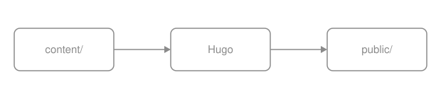
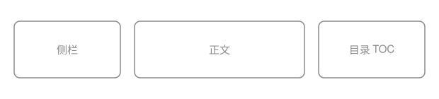
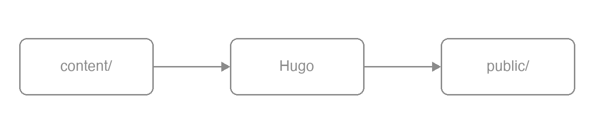

The Draw.io integration has neither a fence nor a shortcode — it uses plain
Markdown images. Tick "Include a copy of my diagram" when exporting from
Draw.io and the SVG or PNG carries an `mxfile` copy inside it; the theme's
runtime spots that copy and adds an edit button to the image. It suits diagrams
readers are meant to take away and change. A diagram that is only there to be
looked at is an ordinary [image](/docs/components/image/).

## Shortest form {#minimal}

The syntax is the plain image syntax. The filename does not matter;
`.drawio.svg` is only a convention.

```markdown {title="Source"}

{width="620" height="140"}
```


{width="620" height="140"}

An export that carries an `mxfile` copy is wrapped in a `.drawio` container.
Hover it and a pencil button appears at the bottom right; clicking lays a
full-screen iframe over the page and loads the editor the site configured.

## How the copy is detected {#detection}

The runtime looks at one thing: whether the file's contents contain `mxfile`.
The filename is irrelevant. A hand-drawn SVG written exactly the same way — a
block image with the same attribute line — carries no copy, so it gets no
button.

```markdown {title="Source"}

{width="620" height="140"}
```


{width="620" height="140"}

## With a caption {#caption}

Draw.io images go through the ordinary image render hook, so every
[image](/docs/components/image/) attribute still applies. Add `caption` for a
captioned figure; the edit button still appears on the image.

```markdown {title="Source"}

{caption="Content, configuration and theme templates flow into Hugo and out as public/" width="620" height="140"}
```


{caption="Content, configuration and theme templates flow into Hugo and out as public/" width="620" height="140"}

## As a numbered figure {#numbered}

Add `{#id num=…}` for a cross-referenceable numbered figure, which `xref` can
reach and which appears in the list of figures like any other.

```markdown {title="Source"}

{#fig_pipeline num="1-1" caption="From content to a static site" width="620" height="140"}
```


{#fig_pipeline num="1-1" caption="From content to a static site" width="620" height="140"}

The complete numbering and cross-reference rules are in
[publishing books](/docs/write/book/).

## SVG or PNG {#svg-or-png}

Both are recognized. A Draw.io PNG export can carry the same copy in a text
chunk, and the runtime's test is identical.

```markdown {title="Source"}

{width="620" height="140"}
```


{width="620" height="140"}

Prefer SVG in documentation: it scales without loss, its text is real text
(searchable, readable by screen readers) and its diffs are legible. Use PNG when
the diagram is very complex or the target platform cannot take SVG. Only PNG can
go through Hugo's image processing; operations on SVG warn and leave the source
unchanged, and strict builds reject the warning.

## What the button does {#editing}

Three things, in order.

{}

### Lay an overlay over the page {#editing-overlay}

A full-screen `div.drawioframe` is inserted holding an iframe whose address is
the configured `drawio_server` plus a fixed query string
(`embed=1&ui=atlas&proto=json&saveAndEdit=1&noSaveBtn=1`).

### Hand the diagram to the editor {#editing-load}

Once the editor is ready, the runtime sends this image's contents — the `mxfile`
copy included — into the iframe as a data URL. That step does not go through
your server.

### Save and write back {#editing-save}

Saving in the editor makes it export in the original format, SVG or PNG, and the
browser downloads it under the same name. The runtime never writes to the
repository: overwrite the file in `content/` with what you downloaded and commit
it yourself.

{}

The edit button is there so a reader can take the diagram away and change it. It
is not online editing of the site.

## The editor address {#server}

```yaml {title="hugo.yml"}
params:
  drawio:
    enable: true
    drawio_server: https://drawio.internal.example/
```

- `enable: true` without `drawio_server` warns and disables editing; strict
  builds fail on that warning. The theme does not pick a public service.
- When editing has to stay inside the organization, deploy a
  [self-hosted editor](https://github.com/jgraph/docker-drawio) and point at it.
- The public endpoint `https://embed.diagrams.net/` works, and the reader's
  diagram then travels to a third-party page.

Both keys are defined in
[Configuration](/docs/customize/config/).

## Output {#outputs}

| Output | Shape |
| --- | --- |
| HTML | A plain `` or `<figure>`; once enabled, the runtime wraps an image that carries a copy in `<div class="drawio">` and adds the button |
| Print | The image prints as usual; the button is hidden except on hover, so it never reaches paper |
| Markdown | Plain Markdown image syntax |
| RSS | A plain `` with an absolute URL and no button |

The image itself exists in all four states; the edit button is an increment on
top.

## Parameter reference {#reference}

There are no fence or shortcode parameters of its own. The image attribute line
is the one from [Images](/docs/components/image/): `caption`, `width`, `height`,
`link`, `#id`, `num`, `command`, `options`.

Site parameters (`hugo.yml`):

| Parameter | Type | Default | Description |
| --- | --- | --- | --- |
| `params.drawio.enable` | bool | `false` | With it off no script loads and an image is just an image |
| `params.drawio.drawio_server` | string | none | The editor address; required when `enable: true` |
{.fields meta="type default"}

## Limits {#limits}

- The runtime loads only when rendered page content contains `.svg` or `.png`
  candidates. It groups matching images by URL, then reads each URL once to
  look for `mxfile`.
- Forget to tick "Include a copy of my diagram" on export and the image is just
  an image, with no button.
- Editing needs the editor and never writes back: offline, the images display
  fine and the button does nothing; saving is a browser download, and replacing
  the file and committing it are manual.
- The button appears on hover only: touch devices have no hover, so readers may
  not find it. Do not present editability as a headline feature.
- Colours do not follow the colour scheme: an exported SVG has fixed colours.
  Set fills to `none` and use neutral greys for lines and text and it reads in
  both modes.

## Related {#related}

- [Images](/docs/components/image/) — captions, numbering, sizing and zoom in full
- [PlantUML](/docs/components/plantuml/) — the other integration that needs a server
- [Mermaid](/docs/components/mermaid/) — diagrams from text with no server at all
- [Configuration](/docs/customize/config/) — the full definition of `params.drawio.*`
