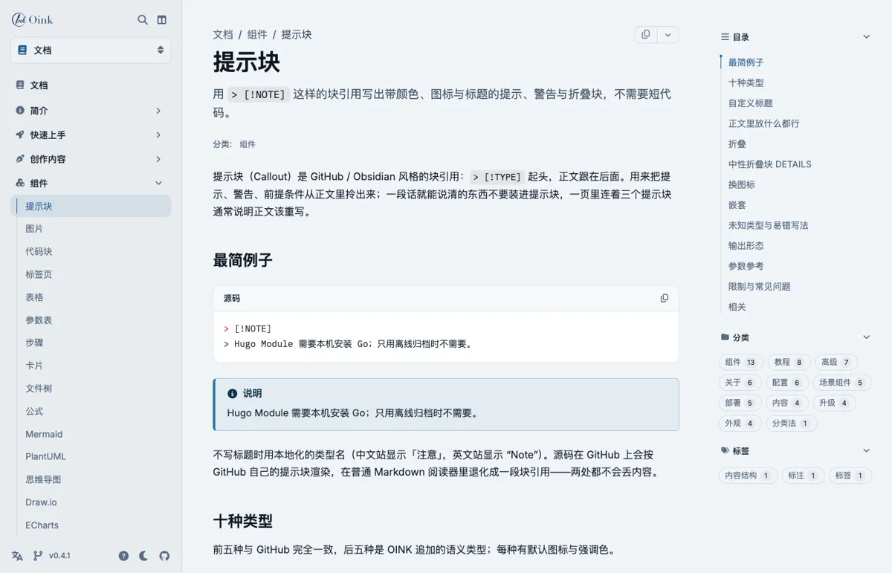
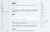
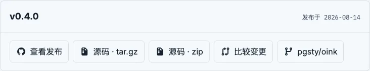

图片只有一种写法：Markdown 的 ``。独立成段的图片可以在下一行跟一行 `{…}` 属性，成为带图注的 figure、缩放候选、编号图或经 Hugo 处理的派生图。主题没有图片 shortcode。

## 最简例子 {#minimal}

```markdown {title="源码"}

```


这张图与本页放在同一目录（页面包）中，主题读取它的固有尺寸并写入 `width`/`height`，页面加载时不发生跳版；所有图片懒加载。替代文字供屏幕阅读器与搜索引擎使用，应当始终填写；空 alt 表示装饰性图片，缩放会跳过它。

## 图片来源 {#sources}
来源按以下顺序解析，写法相同：

| 放法 | 源码里怎么写 | 适合 |
| --- | --- | --- |
| 与页面同目录（页面包 `index.md` + 图片） | `` | 只有这一页用的截图；随页面一起移动、翻译共用 |
| 全局资源 `assets/images/…` | `` | 多页共用、还要做处理（缩放 / 裁切）的图 |
| 静态目录 `static/images/…` | `` | 不需要处理的大图、下载物；主题拿不到尺寸时可以用 `width`/`height` 补 |
| 远程 URL | `` | 少用：构建期不会下载，也不能处理 |

相对路径先按页面资源、再按全局资源查找，都找不到时按静态路径原样输出；主题不检查静态路径与远程 URL 是否存在。只有要求处理（`command=`）的图找不到资源时才构建失败。

## 行内与块级 {#inline-vs-block}
位于文字中间的是行内图片，渲染为一个 ``，不能带属性；独立成段的是块级图片，可以带属性行。

```markdown {title="源码"}
这一枚小图  夹在句子里，是行内图片。


{width="100" height="64"}
```

这一枚小图  夹在句子里，是行内图片。


{width="100" height="64"}

行内图片按自身尺寸显示（这里是 50×32）。没有固有尺寸的 SVG 行内插入时会被拉伸到容器宽度，SVG 应作为块级图片使用并给出 `width`/`height`。

> [!NOTE]
> 块级图片依赖站点设置 `markup.goldmark.parser.wrapStandAloneImageWithinParagraph: false`（本站已配置；见[配置总览](/zh/docs/customize/config/)）。缺少它时 Goldmark 会把独立图片包进 `<p>`，属性行也会被当作正文。

## 图注 {#caption}

属性行加 `caption="…"`，图片渲染为 `<figure>` + `<figcaption>`。图注是纯文本，不解析 Markdown。

```markdown {title="源码"}

{caption="发布卡片由 data/download 与页面的 release 记录生成"}
```


{caption="发布卡片由 data/download 与页面的 release 记录生成"}

Markdown 里的 `"标题"` 保持原义（悬停提示），不会成为图注。

## 尺寸 {#size}

`width`/`height` 是正整数，覆盖资源自身的尺寸：为静态或远程图片提供占位框以避免跳版，或把大图缩小显示（浏览器缩放，不改文件）。

```markdown {title="源码"}

{width="450" height="300" caption="static/images/ 里的 900×600 插画按一半显示"}
```


{width="450" height="300" caption="static/images/ 里的 900×600 插画按一半显示"}

## 处理型图片 {#processing}

页面资源与全局资源可以在构建期由 Hugo 处理：`command` 与 `options` 必须同时给出，命令是 `Fit` `Resize` `Fill` `Crop` 之一，选项是 Hugo 的图片处理字符串。渲染出的 `src` 是派生图；启用缩放时对话框打开原图。

```markdown {title="源码"}

{command="Fit" options="300x150" caption="Fit 300x150：按比例装进 300×150 的框"}


{command="Fill" options="300x150 Left" caption="Fill 300x150 Left：填满框，从左侧裁"}
```


{command="Fit" options="300x150" caption="Fit 300x150：按比例装进 300×150 的框"}


{command="Fill" options="300x150 Left" caption="Fill 300x150 Left：填满框，从左侧裁"}

静态路径、远程 URL 与 SVG 不能处理，对它们写 `command` 会构建失败。选项语法（锚点、质量、格式转换，如 `300x150 webp q80`）见 [Hugo 图片处理](https://gohugo.io/content-management/image-processing/)。

## 链接图片 {#link}
两种写法，用途不同：

- 没有图注、图片本身是链接：用 Markdown 的链接包图 `[](href)`。
- 有图注的 figure 整体可点：属性行加 `link="…"`（必须同时有 `caption` 或 `num`）。

```markdown {title="源码"}
[](/zh/docs/about/features/)


{caption="点击图片查看发布与下载页的说明" link="/zh/docs/write/releases/"}
```

[](/zh/docs/about/features/)


{caption="点击图片查看发布与下载页的说明" link="/zh/docs/write/releases/"}

带链接的图不参与缩放。没有图注只写 `link=` 会构建失败，报错中提示改用 `[](…)`。

## 编号图 {#numbered}

编号图用于书籍与长篇手册：属性行加 `num`，可选 `#id`。编号是作者书写的字符串（`2-1`、`3.4`），主题不自动计数；图注前加本地化的「图 2-1」前缀，`#id` 缺省为 `fig-<num>`。正文用普通链接 `[图 2-1](#fig-2-1)` 或 `xref` shortcode 引用；全书图目录见[书籍出版](/zh/docs/write/book/)。

```markdown {title="源码"}

{#fig-release num="2-1" caption="发布卡片：版本、日期与资产"}

见[图 2-1](#fig-release)。
```


{#fig-release num="2-1" caption="发布卡片：版本、日期与资产"}

见[图 2-1](#fig-release)。

编号图可以同时是处理型图片（`num` + `command`），也可以带 `link`。

## 缩放 {#zoom}

图片缩放默认关闭。站点开启后，块级图片、figure、画廊中带 alt 的图成为可点击的按钮，在原生 `<dialog>` 中查看大图（Esc 关闭，焦点回到原处）。本页在 front matter 中开启了它，上面的图都可以点击。

```yaml {title="hugo.yml"}
params:
  ui:
    image_zoom: true
```

```yaml {title="某一页的 front matter：只关这一页"}
image_zoom: false
```

不缩放的图：行内图、alt 为空的装饰图、带链接的图、`data-no-zoom` 标记的图。运行时只在页面确有候选图时加载；打印 / Markdown / RSS 中没有对话框。

```markdown {title="源码：装饰图不缩放"}

{width="150" height="75"}
```


{width="150" height="75"}

## 深浅色图片 {#dark-mode}
主题没有按深浅色切换图片的参数。需要两张图时，各写一个 `class`，在站点 CSS 中按 `[data-bs-theme="dark"]` 显示其一：

```markdown {title="源码"}

{class="only-light"}


{class="only-dark"}
```

```scss {title="assets/scss/_styles_project.scss"}
[data-bs-theme="dark"] .only-light,
:not([data-bs-theme="dark"]) .only-dark { display: none; }
```

`class` 由主题原样透传，供站点 CSS 使用。

## 输出形态 {#outputs}

| 输出 | 呈现 |
| --- | --- |
| HTML | 行内 ``；块级 ``；有图注 / 编号时 `<figure class="td-figure">` + `<figcaption>`；缩放候选带 `data-td-image-zoom` |
| 打印 | 同 HTML，去掉缩放控件 |
| Markdown | 原样输出 `` 与属性行 |
| RSS | 图片 `src` 改为绝对地址；无缩放 |

## 参数参考 {#reference}

属性行 `{…}`（块级图片之后紧接的一行）：

| 参数 | 类型 | 默认 | 说明 |
| --- | --- | --- | --- |
| `caption` | 纯文本 | — | 有它就渲染成 figure；不解析 Markdown |
| `#id` | 标识符 | 有 `num` 时 `fig-<num>` | `[A-Za-z][A-Za-z0-9_.:-]*`；作为锚点与 Book 目标 ID |
| `num` | 字符串 | — | `[0-9A-Za-z.-]+`；注册为 Book 图目标，图注加「图 N.」前缀 |
| `width` / `height` | 正整数 | 资源固有尺寸 | 覆盖尺寸；静态 / 远程图靠它避免跳版 |
| `command` | 枚举 | — | `Fit` `Resize` `Fill` `Crop`；必须与 `options` 同给；仅页面 / 全局资源 |
| `options` | 字符串 | — | Hugo 图片处理选项，如 `600x300`、`300x150 Left`、`800x webp q80` |
| `link` | URL | — | 把 figure 包进链接；需要 `caption` 或 `num`；带链接的图不缩放 |
| `class` | class 列表 | — | 透传给站点 CSS |
| `data-*` / `aria-*` | 字符串 | — | 透传 |
{.fields meta="type default"}

`style`、`on*`、`alt`、`title`、`src` 与其它任何键出现在属性行都会构建失败（alt、title、src 属于 Markdown 图片本身）。

## 限制与常见问题 {#limits}

- 图注不含 Markdown：所有公开字符串参数都是纯文本；富文本说明写在图片下方的段落中。
- `title` 不是图注：`` 的 `c` 是悬停提示。
- 处理型图片只对资源生效：`static/` 中的图需要处理时移到页面包或 `assets/`。
- 构建期不下载远程图片。
- 缩放不支持拖拽、平移、上一张 / 下一张；一组相关图片使用[画廊](/zh/docs/components/gallery/)。

## 相关 {#related}

- [画廊](/zh/docs/components/gallery/) — 一组图片共用一个缩放对话框
- [书籍出版](/zh/docs/write/book/) — 图目录、`xref` 交叉引用
- [品牌外观](/zh/docs/customize/brand/) — 站点 logo 与 favicon 放哪
- [卡片](/zh/docs/components/cards/) — 卡片上的图片
