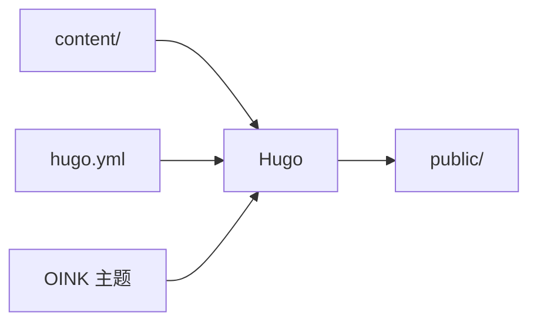
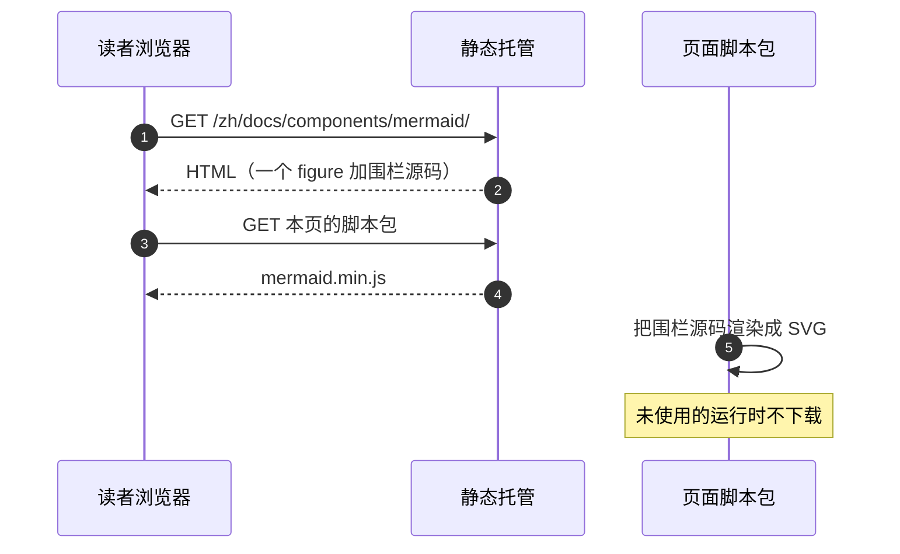
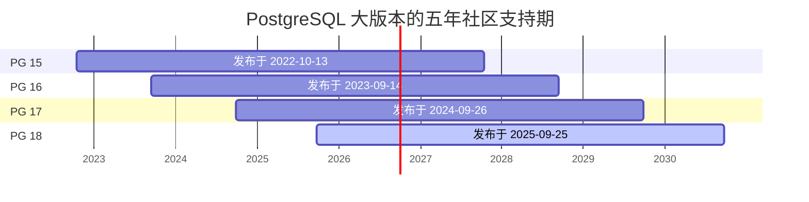
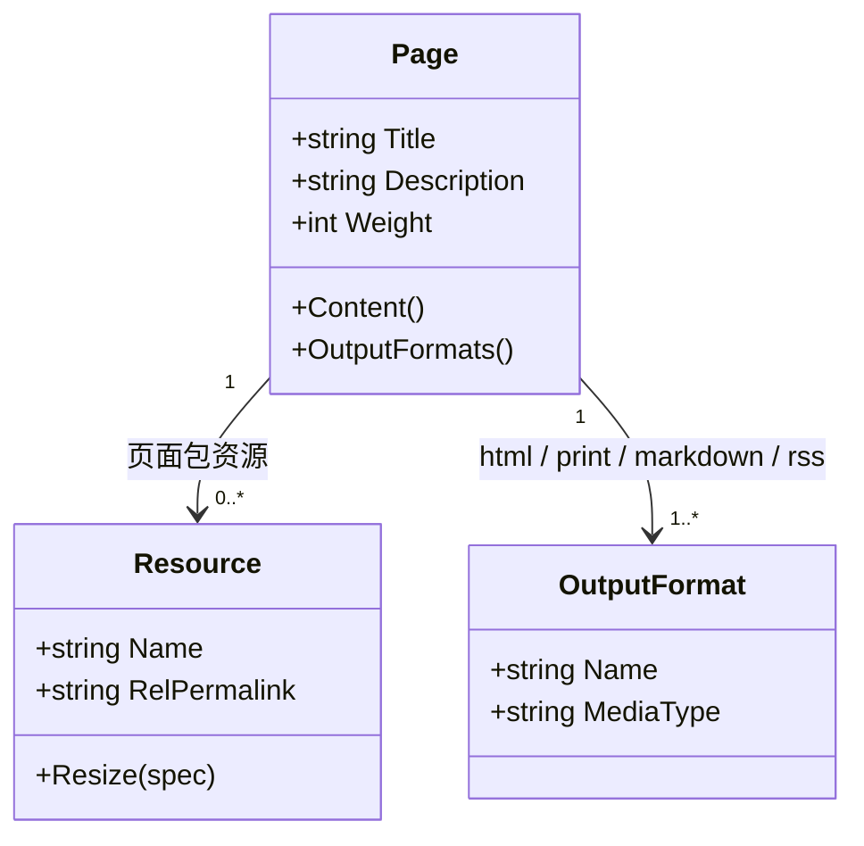
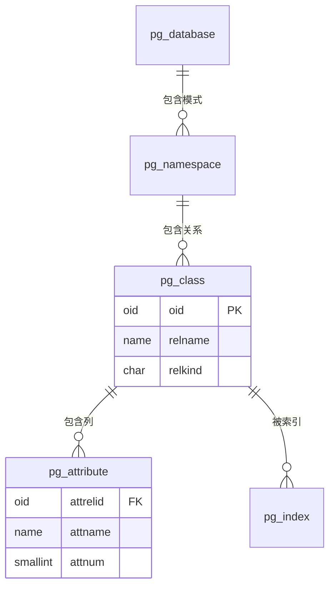
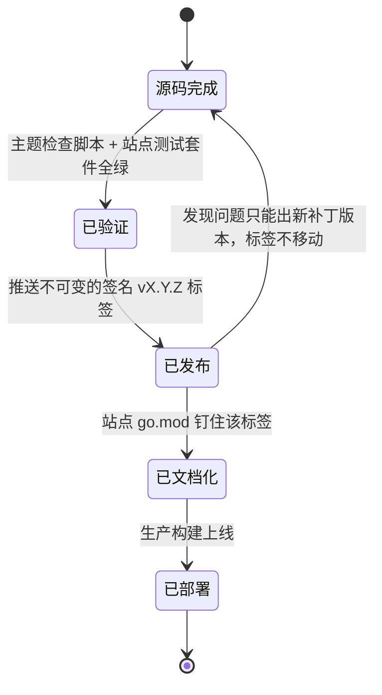
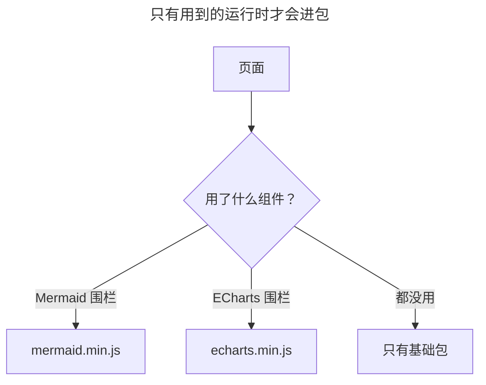
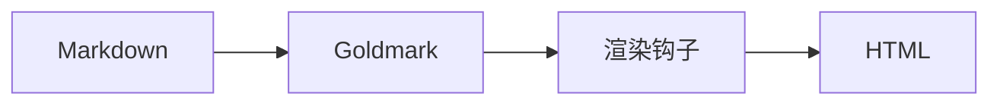
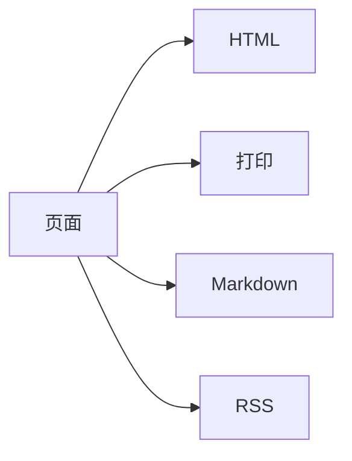

`mermaid` 围栏把一段文本渲染成流程图、时序图、甘特图、类图、ER 图与状态图。图以源码形式存在，可以进 Git、可以 review diff、可以被搜索命中；渲染由主题自带的 Mermaid 在读者浏览器里完成，不请求外部服务。需要像素级控制的示意图画成 SVG，按[图片](/zh/docs/components/image/)使用。

## 最简例子 {#minimal}

````markdown {title="源码"}

````


围栏语言写 `mermaid` 即可，没有其它开关。主题检测到这个围栏后才把 Mermaid 运行时加入这一页，同一页里画十张图也只加载一次。

## 时序图 {#sequence}

`sequenceDiagram` 描述参与者之间按时间发生的消息，适合说明请求链路与加载顺序。

````markdown {title="源码"}

````


## 甘特图 {#gantt}

`gantt` 画时间区间。下面是 PostgreSQL 各大版本从发布日算起的五年社区支持期，`1825d` 即五年。

````markdown {title="源码"}

````


## 类图与 ER 图 {#class-and-er}

`classDiagram` 画类型与关系，`erDiagram` 画实体与基数。两者都常用来解释数据模型。

````markdown {title="源码"}

````


````markdown {title="源码"}

````


## 状态图 {#state}

`stateDiagram-v2` 画状态与迁移条件。下面是 OINK 主题一次发布依次经过的五个状态。这五个状态互不等价，本地构建通过不属于其中任何一个。

````markdown {title="源码"}

````


## 单张图的标题与配置 {#per-diagram-config}

围栏正文最前面可以写 Mermaid 自己的 YAML 头，它不是 Hugo front matter。`title` 给图加标题，`config` 覆盖这一张图的 Mermaid 配置。写死 `config.theme` 的图不再跟随站点深浅色。

````markdown {title="源码"}

````


## 深浅色 {#dark-mode}

页面初始化时主题读取当前配色模式：深色模式下用 Mermaid 的 `dark` 主题，浅色模式下用站点配置的主题。读者切换配色时图会就地重绘，页面不会重载；重绘期间每张图保持原有高度，页面不会在读者眼皮底下跳动。

因此不要把 Mermaid 图放进需要保留输入状态的页面，例如带表单的页面。

站点级默认写在 `hugo.yml` 里，键名小写，主题按 Mermaid 的默认配置匹配回正确的大小写：

```yaml {title="hugo.yml"}
params:
  mermaid:
    theme: neutral
    flowchart:
      diagrampadding: 6
```

完整键表见[配置总览](/zh/docs/customize/config/)，可用值以 [Mermaid 配置文档](https://mermaid.js.org/config/schema-docs/config.html)为准。

## 放进标签页与步骤 {#compose}

`mermaid` 围栏没有 `tab` 属性，相邻围栏标签页只对普通代码围栏生效。并排比较两张图用 `tabs` shortcode。

````markdown {title="源码"}








````










`{}` 里的每一步是页面级 Markdown，其中可以写 `mermaid` 围栏，用法见[步骤](/zh/docs/components/steps/)。

## 输出形态 {#outputs}

| 输出 | 呈现 |
| --- | --- |
| HTML | 一个 `figure`，里面是空舞台加上以 JSON 保存的围栏源码，页面的 Mermaid 运行时把 SVG 画进去 |
| 打印 | `<pre class="td-mermaid-source">` 包着的源码，静态输出，不跑运行时 |
| Markdown | 原样保留 `mermaid` 围栏与它的源码 |
| RSS | `<pre class="td-mermaid-source">` 包着的源码，订阅端看到的是文本 |

## 参数参考 {#reference}

围栏属性：没有。`mermaid` 围栏不读属性行，写 `{height=…}`、`{class=…}` 之类既不生效也不报错；尺寸由图自身与容器宽度决定，并在其中居中。

站点参数（`hugo.yml`）：

| 参数 | 类型 | 默认 | 说明 |
| --- | --- | --- | --- |
| `params.mermaid` | map | 未设置 | 整个映射按 Mermaid 的 `initialize()` 配置传入；键名写小写，主题按 Mermaid 默认配置匹配回正确大小写 |
| `params.mermaid.theme` | string | Mermaid 默认 | 浅色模式下的主题；深色模式下被强制为 `dark` |
{.fields meta="type default"}

单张图的配置写在围栏正文最前面的 YAML 头里（`title`、`config`），属于 Mermaid 语法，不是主题参数。

## 放大查看 {#zoom}

图在正文栏里居中；比栏宽更宽的图会被 Mermaid 缩小到能放下为止——一张宽的时序图在手机上可能只剩自身尺寸的三分之一。把指针移到图上（或用键盘走到它），图的角上会出现一个按钮，点开后图会按原始尺寸重新渲染一遍：拖动平移，滚轮、双指捏合或 `+` `-` 键缩放，`0` 复位，`Esc` 关闭。如果一张图要缩到一半以下才放得下，它会按 1:1 停在起始角打开而不是变成缩略图；而无论多大，往回缩总能看到整张图。这一切不下载任何东西，也没有开关要配置，它跟着围栏一起来。

## 限制与常见问题 {#limits}

- 图不能编号：Mermaid 输出的是内联 SVG，不是 ``，`{#id num=}` 编号不适用；需要编号时导出成图片，按[图片](/zh/docs/components/image/)的编号写法使用。
- 围栏属性无效：宽度在图里控制（`flowchart` 的方向、`classDiagram` 的布局），或者用 CSS。也没有对齐属性——图总是居中。
- 语法错误只在浏览器里可见：Hugo 不解析 Mermaid 语法，写错的图在页面上显示一条带解析错误与图源码的提示，构建照样通过，发布前要在浏览器里确认。
- RSS、Markdown 与打印输出里是源码而不是图：结论要写在正文里，不要只画在图上。

## 相关 {#related}

- [PlantUML](/zh/docs/components/plantuml/) — UML 更全，但需要一个渲染服务
- [思维导图](/zh/docs/components/markmap/) — 大纲式的层级图
- [ECharts](/zh/docs/components/echarts/) — 有数值的统计图
- [图片](/zh/docs/components/image/) — 手绘 SVG、需要编号的图
