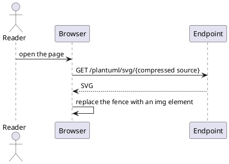
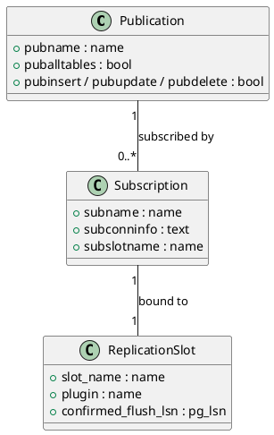
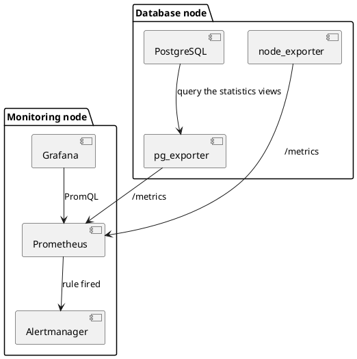
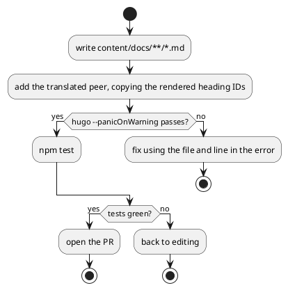
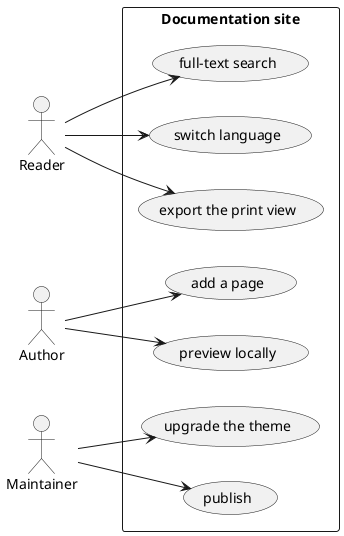
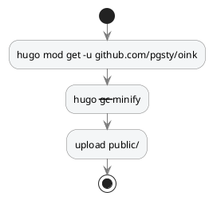

A `plantuml` fence holds PlantUML source. The browser compresses and encodes it,
appends it to the URL of a PlantUML server, and gets an SVG back. It suits
sequence, class, component, activity and use-case diagrams that need the full
expressiveness of UML. Rendering depends on that server: the theme ships no
default endpoint, and `enable: true` without `svg_image_url` fails the build.
With no server available, use [Mermaid](/docs/components/mermaid/) instead.

> [!WARNING] This page shows source only, not rendered diagrams
> PlantUML has to reach a server you run, and this site assumes no endpoint on
> the reader's behalf. In the current theme version the `plantuml` fence also
> double-escapes `<`, `>`, `&` and `"`, so source with arrows or quotes comes
> back from the endpoint as a `Syntax Error?` image (see [Limits](#limits)).
> Every snippet below is correct PlantUML in itself.

> [!IMPORTANT] Diagrams leave the reader's browser
> The encoded diagram source is sent to the endpoint you configure. Never put
> passwords, internal hostnames or customer names in a PlantUML fence. Internal
> sites should run their own endpoint, or use a pre-rendered
> [image](/docs/components/image/).

## Shortest form {#minimal}

Sequence diagrams are the most common kind: `participant` declares a
participant, `->` is a synchronous message, `-->` a return.

````markdown {title="Source"}

````

That draws four lanes and four messages: the reader opens the page, the browser
requests the endpoint with the encoded source, the endpoint returns SVG, and the
runtime swaps the fence for an image.

## Class diagrams {#class}

`class` lists members and `"1" -- "0..*"` gives a relationship its cardinality —
the usual way to explain a data model.

````markdown {title="Source"}

````

Three boxes with their fields and two annotated connectors: one publication can
serve many subscriptions, and every subscription binds one replication slot.

## Component diagrams {#component}

`package` groups deployment units, `[component]` is a box, and `-->` is the
direction of a dependency.

````markdown {title="Source"}

````

Two dashed boxes with three components each, and five labelled arrows tracing
the collection path.

## Activity diagrams {#activity}

`start` / `stop` with `if … then … else … endif` draws a branching procedure.
This kind contains no arrow characters, so it is the one kind that renders
correctly in the current version.

````markdown {title="Source"}

````

One vertical flow line, two diamonds each branching yes / no, four end points.

## Use-case diagrams {#usecase}

`actor` is a stick figure, `(use case)` an ellipse, and `rectangle` draws the
system boundary — a good fit for a "who is this for" section.

````markdown {title="Source"}

````

Three figures on the left, one box with seven ellipses on the right, and
connectors saying who can do what.

## Colours in dark mode {#dark-mode}

The server knows nothing about the site's colour scheme, so the SVG comes back
on a fixed white ground. `skinparam backgroundColor transparent` removes it and
the diagram sits on the page background. With neutral lines and text it reads in
both modes.

````markdown {title="Source"}

````

PlantUML's `!theme` directive (`!theme plain`, for instance) also works. Themes
come from the server, so a self-hosted endpoint has to have them installed.

## The rendering server {#server}

The fence itself has no switch; whether it renders depends on the site
configuration:

```yaml {title="hugo.yml"}
params:
  plantuml:
    enable: true
    svg_image_url: https://plantuml.internal.example/plantuml/svg/
    svg: false
```

- `enable: true` without `svg_image_url` fails the build with
  `params.plantuml.enable requires an explicit params.plantuml.svg_image_url`.
  The theme does not pick a public service for the site.
- To self-host, the official image
  [`plantuml/plantuml-server`](https://github.com/plantuml/plantuml-server)
  works; point `svg_image_url` at its `/svg/` path and **keep the trailing
  slash** — the encoded source is appended to it.
- The endpoint's CORS policy and the site's CSP `img-src` (plus `connect-src`
  when `svg: true`) must both allow it; use an absolute URL on a subpath
  deployment.

These keys are defined in
[Configuration](/docs/customize/config/).

## Output {#outputs}

| Output | Shape |
| --- | --- |
| HTML | The source is emitted as `<pre><code class="language-plantuml">`; once enabled, the runtime replaces it with an `` (with `svg: true`, an `<svg data-src>`) |
| Print | Same as HTML: the print view loads the runtime and requests the endpoint too |
| Markdown | The `plantuml` fence and its source, kept as written |
| RSS | The fence source only — subscribers see text |

When the feature is off, or the runtime has not loaded, what stays on the page
is a readable source block, never a broken-image icon.

## Parameter reference {#reference}

Fence attributes: none. A `plantuml` fence reads no attribute line and does not
go through OINK's code-block shell, so `title`, `copy` and the line-number
options from [Code blocks](/docs/components/code/) have no effect here.

Site parameters (`hugo.yml`):

| Parameter | Type | Default | Description |
| --- | --- | --- | --- |
| `params.plantuml.enable` | bool | `false` | With it off, the fence stays a code block and no runtime loads |
| `params.plantuml.svg_image_url` | string | none | The rendering endpoint; the encoded source is appended to it. Required when `enable: true`, otherwise the build fails |
| `params.plantuml.svg` | bool | `false` | `false` inserts ``; `true` inserts `<svg data-src>` and loads an external SVG loader, putting the SVG in the DOM where CSS can reach it |
{.fields meta="type default"}

The theme reads those three keys and nothing else.

## Limits {#limits}

- `<`, `>`, `&` and `"` are double-escaped: the current theme version escapes the
  fence content once too often, leaving literal `--&gt;` and `&#34;` in the page
  and returning a `Syntax Error?` image from the endpoint. Diagrams with arrows
  (sequence, component, use case, state) therefore do not render today; activity
  diagrams, which contain none of those characters, do. Until it is fixed, use
  [Mermaid](/docs/components/mermaid/) or a pre-rendered
  [image](/docs/components/image/).
- A server is mandatory: the theme provides no default endpoint and assumes
  none.
- Diagram source leaves the browser: keep anything confidential out of a
  PlantUML fence.
- No colour-scheme awareness: the server does not know the reader's mode, so
  `skinparam` is the only lever.
- No numbering, no zoom: the `` the runtime inserts does not pass through
  the image render hook, so `{#id num=}` and image zoom do not apply.

## Related {#related}

- [Mermaid](/docs/components/mermaid/) — no server, follows the colour scheme, the everyday choice
- [Draw.io](/docs/components/drawio/) — the other integration that needs a server of your own
- [Images](/docs/components/image/) — pre-rendered SVG: numberable, zoomable, no external dependency
- [Configuration](/docs/customize/config/) — the full definition of `params.plantuml.*`
