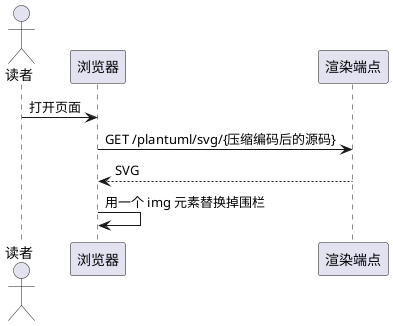
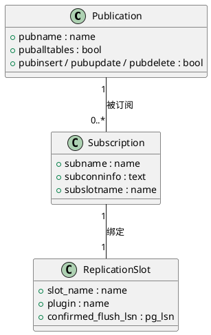
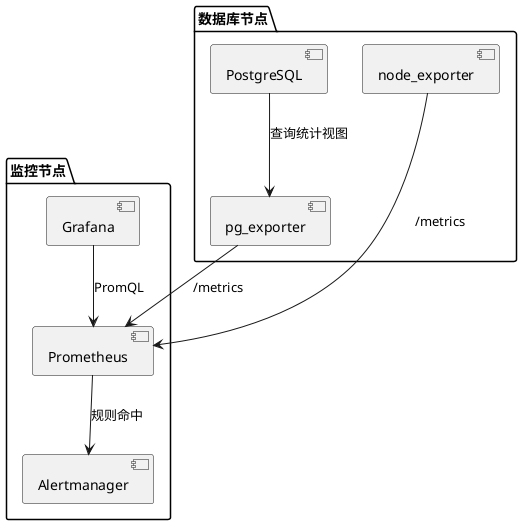
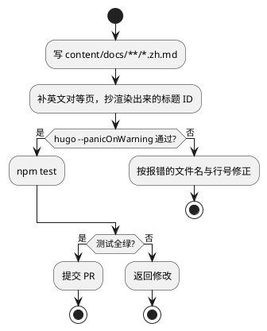
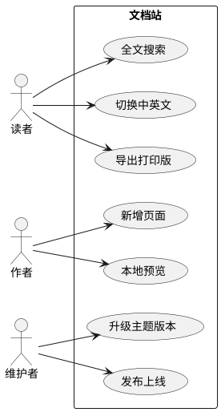
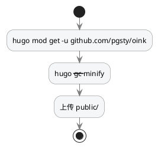

`plantuml` 围栏里写 PlantUML 源码，浏览器把源码压缩编码后拼在一个 PlantUML 服务的 URL 后面，换回一张 SVG。适合需要完整 UML 表达力的时序图、类图、组件图、活动图与用例图。渲染依赖一个渲染服务：主题不提供默认端点，`enable: true` 却没给 `svg_image_url` 会让构建失败；没有可用服务时改用 [Mermaid](/zh/docs/components/mermaid/)。

> [!WARNING] 本页只给源码，不放渲染结果
> PlantUML 要连你自己的服务，本站不假设读者有哪个端点可用。当前主题版本的 `plantuml` 围栏还会把 `<`、`>`、`&`、`"` 二次转义，带箭头或引号的源码送到端点后返回 `Syntax Error?` 图（见[限制与常见问题](#limits)）。下面每段源码本身都是正确的 PlantUML。

> [!IMPORTANT] 图会离开读者的浏览器
> 编码后的图表源码作为 URL 发给你配置的端点。不要在 PlantUML 图里写口令、内网主机名或客户名称。内网站点自建端点，或改用预渲染的[图片](/zh/docs/components/image/)。

## 最简例子 {#minimal}

时序图是 PlantUML 最常用的一类：`participant` 声明参与者，`->` 是同步消息，`-->` 是返回。

````markdown {title="源码"}

````

画出来是四条泳道、四条消息的一张时序图：读者打开页面 → 浏览器带着编码后的源码请求端点 → 端点返回 SVG → 运行时把围栏替换成图片。

## 类图 {#class}

`class` 写成员，`"1" -- "0..*"` 写关系基数，用来解释数据模型。

````markdown {title="源码"}

````

三个方框各带一列字段，两条带基数标注的连线：一个发布可以被多个订阅使用，每个订阅绑定一个复制槽。

## 组件图 {#component}

`package` 圈出部署单元，`[组件]` 是方块，`-->` 是依赖方向。

````markdown {title="源码"}

````

两个虚线框，框里各三个组件方块，五条带标注的箭头串起采集链路。

## 活动图 {#activity}

`start` / `stop` 加 `if … then … else … endif` 画带分支的流程。这类图不含箭头字符，是当前版本里能正常渲染的一类。

````markdown {title="源码"}

````

一条竖向流程线，两个菱形判断各分出「是 / 否」两支，四个终点。

## 用例图 {#usecase}

`actor` 是小人，`(用例)` 是椭圆，`rectangle` 圈出系统边界，适合放在文档的「读者是谁」一节。

````markdown {title="源码"}

````

左边三个小人，右边一个方框里七个椭圆，连线表示谁能做什么。

## 深色模式下的配色 {#dark-mode}

服务端不知道站点的配色模式，渲染出来的 SVG 底色是固定的白色。`skinparam backgroundColor transparent` 去掉底色，图落在页面背景上。线条与文字设成中性色后，两种模式下都可读。

````markdown {title="源码"}

````

PlantUML 的 `!theme` 指令（例如 `!theme plain`）也可用，主题包由服务端提供，自建端点需要确认已安装。

## 渲染服务 {#server}

围栏本身没有开关，能否渲染取决于站点配置：

```yaml {title="hugo.yml"}
params:
  plantuml:
    enable: true
    svg_image_url: https://plantuml.internal.example/plantuml/svg/
    svg: false
```

- `enable: true` 却没写 `svg_image_url` → 构建报错 `params.plantuml.enable requires an explicit params.plantuml.svg_image_url`。主题不代替站点选择公共服务。
- 自建可以用官方镜像 [`plantuml/plantuml-server`](https://github.com/plantuml/plantuml-server)，`svg_image_url` 指向它的 `/svg/` 路径，**结尾的斜杠不能省略**，编码后的源码拼在它后面。
- 端点的跨域策略、站点 CSP 的 `img-src`（`svg: true` 时还有 `connect-src`）都要放行；子路径部署时写绝对 URL。

这几个键的完整定义在[配置总览](/zh/docs/customize/config/)。

## 输出形态 {#outputs}

| 输出 | 呈现 |
| --- | --- |
| HTML | 先输出 `<pre><code class="language-plantuml">` 源码，启用后由运行时替换成 ``（`svg: true` 时是 `<svg data-src>`）|
| 打印 | 与 HTML 相同：打印视图同样加载运行时并请求端点 |
| Markdown | 原样保留 `plantuml` 围栏与它的源码 |
| RSS | 只有围栏源码，订阅端看到的是文本 |

未启用、或运行时没有加载时，页面上留下的是一段可读的源码块，不会出现坏图标。

## 参数参考 {#reference}

围栏属性：没有。`plantuml` 围栏不读属性行；它也不走 OINK 的代码块外壳，`title`、`copy`、行号这些[代码块](/zh/docs/components/code/)参数在这里都无效。

站点参数（`hugo.yml`）：

| 参数 | 类型 | 默认 | 说明 |
| --- | --- | --- | --- |
| `params.plantuml.enable` | bool | `false` | 关闭时围栏保持为代码块，不加载运行时 |
| `params.plantuml.svg_image_url` | string | 无 | 渲染端点，编码后的源码直接拼在它后面；`enable: true` 时必填，否则构建失败 |
| `params.plantuml.svg` | bool | `false` | `false` 插 ``；`true` 插 `<svg data-src>` 并额外加载外部 SVG 加载器，SVG 内容进 DOM、可被 CSS 影响 |
{.fields meta="type default"}

主题只读这三个键，其它键写了没有效果。

## 限制与常见问题 {#limits}

- `<`、`>`、`&`、`"` 会被二次转义：当前主题版本的 `plantuml` 围栏对内容多做了一次转义，页面上留下 `--&gt;`、`&#34;` 这样的字面文本，端点收到后返回一张 `Syntax Error?` 图。带箭头的图（时序、组件、用例、状态）目前渲染不出来，只有活动图这类不含这些字符的能正常渲染。修复前请改用 [Mermaid](/zh/docs/components/mermaid/) 或预渲染的[图片](/zh/docs/components/image/)。
- 必须有服务：主题不提供、也不默认任何公共端点。
- 图表源码会离开浏览器：涉密内容不要写进 PlantUML 围栏。
- 不跟随深浅色：服务端不知道读者的配色模式，只能靠 `skinparam` 自己调。
- 不能编号、不能缩放：运行时插入的 `` 不经过图片渲染钩子，`{#id num=}` 与图片缩放都用不上。

## 相关 {#related}

- [Mermaid](/zh/docs/components/mermaid/) — 不需要服务、跟随深浅色，日常首选
- [Draw.io](/zh/docs/components/drawio/) — 同样需要自建服务的另一个图表集成
- [图片](/zh/docs/components/image/) — 预渲染 SVG，可编号、可缩放、无外部依赖
- [配置总览](/zh/docs/customize/config/) — `params.plantuml.*` 的完整定义
